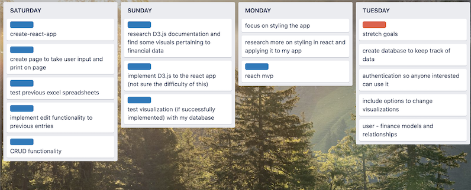

# Viz-Money
The vizualization app for tracking budget and spendings.  Viz-Money takes your budget, expenses, or financial goals and vizualizes your progress.  Whether you are on track to saving money or need to cut back on spending, Viz-Money will show you what needs to be done.

[Link to Viz-Money](https://viz-money.vercel.app/)

## What is the problem?
The goal was to learn how to implement D3.js in React to have a dynamic chart representing daily expenditures.  Since React is relatively new, specifically hooks, many of the documentations on implementation were outdated and hard to find.  This was a challenge in and of itself because it required more digging and research than what I had initially anticipated.

## Strategy / Approach

The very first thing I did was create a trello board with tasks to complete the project.  Next, I distributed tasks to each day depending on how much time I needed to reach the goal.  Finally, I broke down any tasks I did not fully comprehend through research and similar solutions.

## What I Learned
I could not find any projects on the web similar to mine that I could lean on for learning purposes.  First and foremost, I learned to focus and persevere until I had gotten my answers.  This included reading over React and D3 documentation and testing through trial and error.  I began to understand more of the syntax pertaining to D3 which I had never seen before prior to this project.  I also learned more in depth the various states in React and how they render dynamically throughout each state.

I was not able to implement user authentication and custom database in the time I allotted myself, but I did gain a bit more experience in styling React apps with custom CSS.

## Afterthought
This project was a really great exercise in learning new technology because it challenged me with research and focus.  There were times I could have easily gotten distracted but I just kept pushing through.  The hardest part was implementing the chart itself in React using hook state.  Bringing Viz-Money to life without knowing what I was doing was a tough thing to sit with.  However, I am glad I stuck with it because it gave me more self confidence in learning and my ability to learn new things.  Overall, this project was super fun and educational.